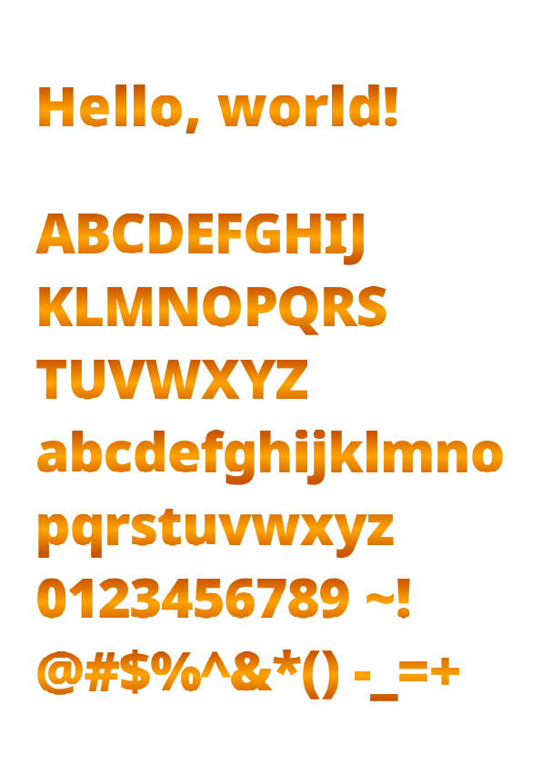

# Noto Sans Black and Noto Serif With COLR/CPAL Tables

Both fonts have six linear gradient colors.

Please change the value of the **base-palette** in the HTML file from 0 to 5 to see the different colors

